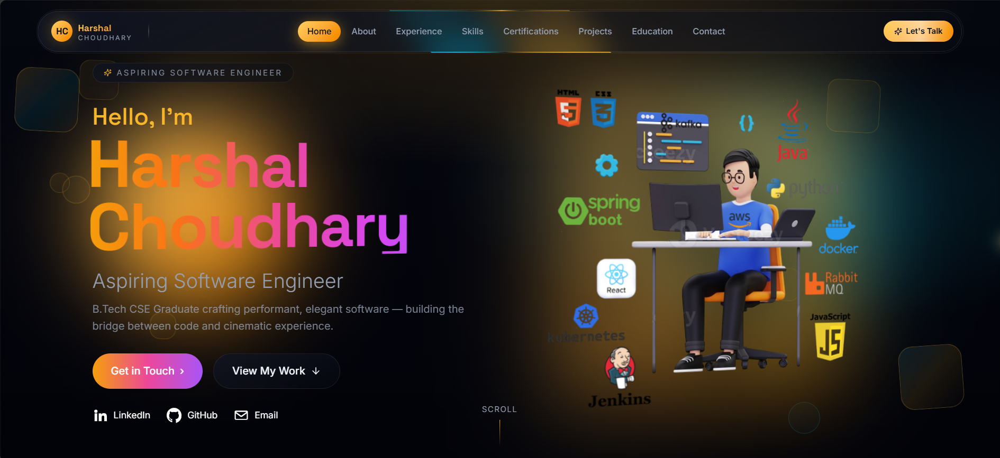
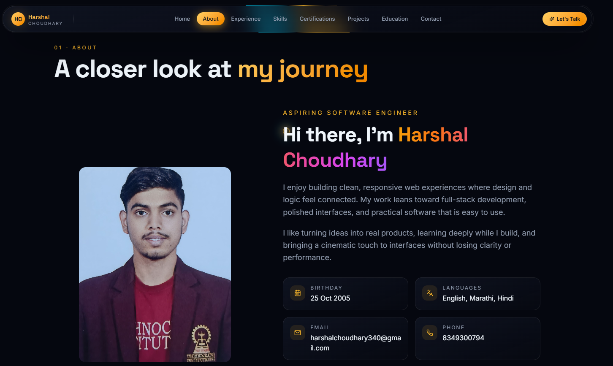
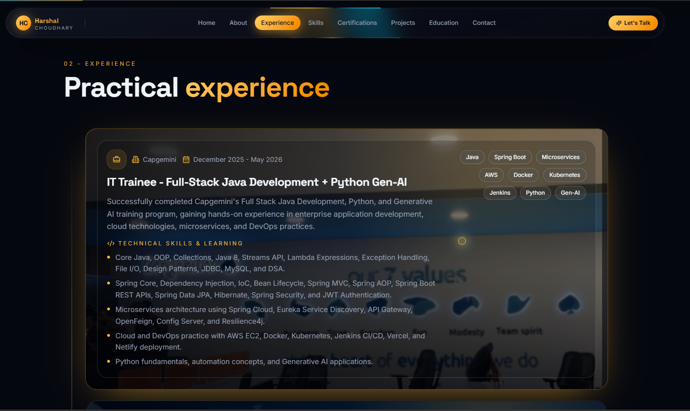
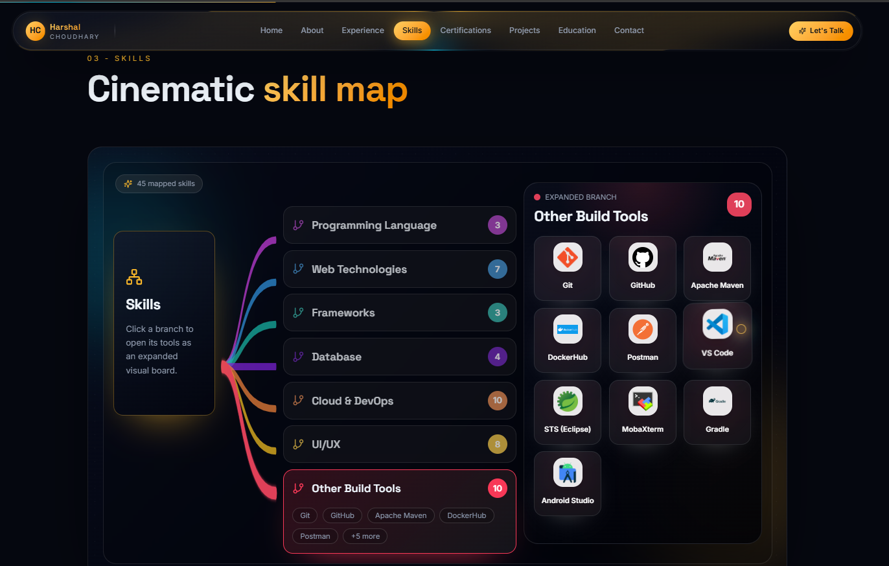
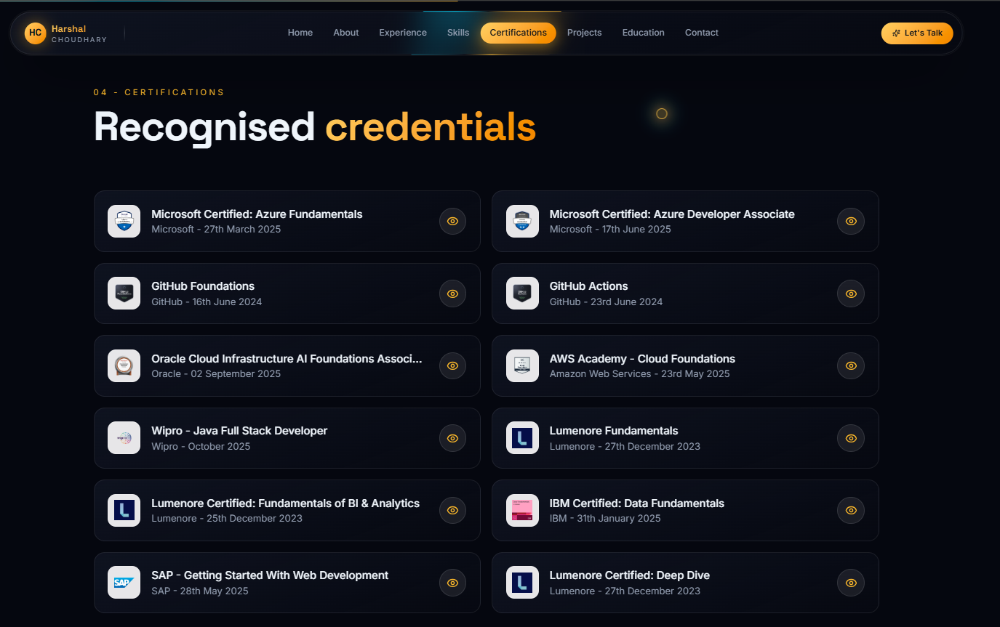
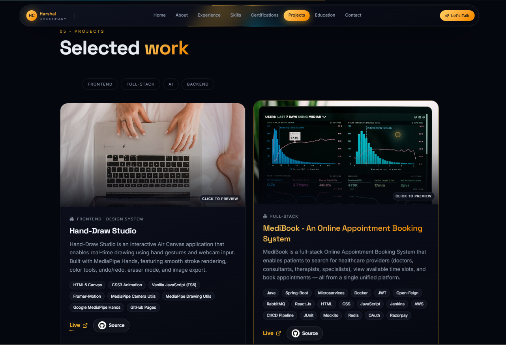
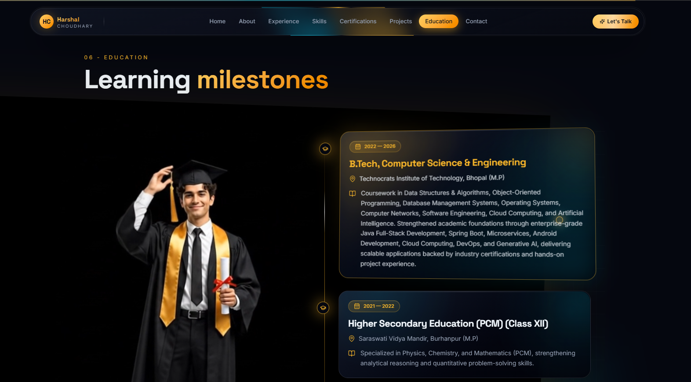
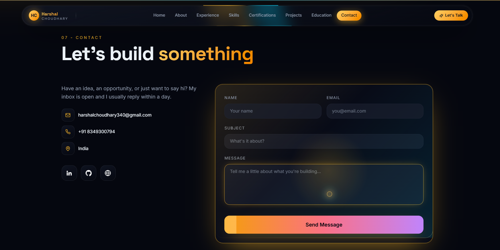

<div align="center">

# 🎬 Harshal Choudhary — Cinematic Portfolio

### *Building the bridge between code and cinematic experience.*

[](https://react.dev/)
[](https://vitejs.dev/)
[](https://tailwindcss.com/)
[](https://www.framer.com/motion/)
[](./LICENSE)

**A dark, glassmorphic, motion-first developer portfolio — engineered like a product, animated like a film.**

[Live Demo](https://h4r5h4l-portfolio.vercel.app/) · [Report a Bug](https://github.com/Harshal-25C/H4r5h4l-Portfolio/issues) · [Request a Feature](https://github.com/Harshal-25C/H4r5h4l-Portfolio/issues)

</div>

---

## 📖 Table of Contents

- [About the Project](#-about-the-project)
- [Preview Gallery](#-preview-gallery)
- [Tech Stack](#-tech-stack)
- [Project Structure](#-project-structure)
- [Features](#-features)
- [Getting Started](#-getting-started)
- [Environment Variables](#-environment-variables)
- [Available Scripts](#-available-scripts)
- [Test Cases & QA Checklist](#-test-cases--qa-checklist)
- [Sections Breakdown](#-sections-breakdown)
- [Deployment](#-deployment)
- [Roadmap](#-roadmap)
- [Contact](#-contact)
- [License](#-license)

---

## 🌌 About the Project

This repository powers the personal portfolio of **Harshal Choudhary**, an aspiring Software Engineer and B.Tech CSE graduate. — a single-page React application designed to feel *cinematic*: soft gold-and-violet gradients, glass-panel cards, animated conic-gradient borders, floating shapes, and scroll-triggered motion, all wrapped around a clean, professional narrative of who Harshal is as an engineer.

The goal was simple: **don't just list information — perform it.** Every section (Hero, About, Experience, Skills, Certifications, Projects, Education, Contact) is built as its own animated component, stitched together into one smooth-scrolling story with a sticky, pill-shaped navigation bar that tracks the active section as you scroll.

> B.Tech CSE graduate crafting performant, elegant software — building the bridge between code and cinematic experience.

| | |
|---|---|
| 🎓 **Education** | B.Tech, Computer Science & Engineering — Technocrats Institute of Technology, Bhopal (2022–2026) |
| 💼 **Current Role** | Software Engineer — Full‑Stack Java Development + Python Gen‑AI @ Capgemini |
| 📍 **Location** | Mumbai, India |
| 📧 **Email** | harshalchoudhary340@gmail.com |
| 📞 **Phone** | +91 8349300794 |

---

## 🖼️ Preview Gallery

> All screenshots below are taken directly from the live application — 100% original, unedited captures of every section.

### 🏠 Home / Hero Section
Full-viewport intro with animated name gradient, a floating "developer at desk" illustration ringed by tech-stack icons (HTML5, CSS3, Java, Python, React, Spring Boot, AWS, Docker, Kubernetes, Kafka, RabbitMQ, JavaScript, Jenkins), and quick links to **Get in Touch**, **View My Work**, LinkedIn, GitHub, and Email.



---

### 👤 About Section
A closer look at Harshal's journey — profile photo, personal bio, and quick-info cards for Birthday, Languages, Email, and Phone.



---

### 💼 Experience Section
Timeline-style animated cards detailing real-world internship/traineeship experience, complete with duration badges and a tag cloud of technologies used.



---

### 🧠 Skills Section — "Cinematic Skill Map"
An interactive, branch-based skill tree (45 mapped skills across 7 categories) — click any branch (Programming Languages, Web Technologies, Frameworks, Database, Cloud & DevOps, UI/UX, Other Build Tools) to expand it into a visual icon board on the right.



---

### 🏆 Certifications Section
A responsive, two-column grid of "Recognised Credentials" — each entry shows the issuing body, exact issue date, and an eye icon to preview the certificate PDF in a lightbox.



---

### 🚀 Projects Section — "Selected Work"
Filterable project gallery (Frontend / Full-Stack / AI / Backend) rendered as interactive preview cards. Hovering / clicking an image opens a live lightbox preview; each card lists the full tech stack plus **Live** and **Source** links.



---

### 🎓 Education Section — "Learning Milestones"
A vertical animated timeline of academic history, paired with a graduation portrait, tracing the path from secondary school to B.Tech in Computer Science & Engineering.



---

### ✉️ Contact Section — "Let's Build Something"
A glowing, animated contact card with direct email/phone/location info and social links, next to a fully validated EmailJS-powered contact form (Name, Email, Subject, Message) with animated submit-state feedback.



---

## 🛠️ Tech Stack

| Layer | Technology |
|---|---|
| **Core Framework** | [React 18.3](https://react.dev/) (JavaScript / JSX, no TypeScript) |
| **Build Tool** | [Vite 6](https://vitejs.dev/) with `@vitejs/plugin-react` |
| **Styling** | [Tailwind CSS v4](https://tailwindcss.com/) via `@tailwindcss/vite`, custom OKLCH color tokens, glassmorphism utilities |
| **Animation** | [Framer Motion 11](https://www.framer.com/motion/) — scroll-triggered reveals, layout transitions, conic-gradient border animation |
| **Icons** | [lucide-react](https://lucide.dev/) |
| **Email Delivery** | [@emailjs/browser](https://www.emailjs.com/) — serverless contact form submission |
| **Hosting Targets** | Vercel / Netlify / GitHub Pages |
| **Tooling** | ESLint-ready structure, `.gitignore`, MIT License |

<table>
<tr>
<td valign="top" width="50%">

**Core**
- ⚛️ React 18.3 (JSX)
- ⚡ Vite 6.0
- 🎨 Tailwind CSS v4 (`@tailwindcss/vite`)
- 🎬 Framer Motion 11
- 🎯 Lucide React (icon system)
- ✉️ EmailJS Browser SDK

</td>
<td valign="top" width="50%">

**Tooling**
- 📦 npm
- 🔌 `@vitejs/plugin-react`
- 🗂 ES Modules (`type: module`)
- 🖋 Google Fonts — Space Grotesk, Inter, JetBrains Mono

</td>
</tr>
</table>

### Full Skill Universe Represented on the Site (45 tools across 7 domains)

<table>
<tr><td valign="top">

**Programming Languages**
- Java
- C++
- Python

**Frameworks**
- Spring Boot
- Mockito
- JUnit

</td><td valign="top">

**Web Technologies**
- HTML / CSS / JavaScript
- React.js
- Tailwind CSS
- Framer Motion
- Vite

**Database**
- MySQL
- H2
- PostgreSQL
- Redis

</td><td valign="top">

**Cloud & DevOps**
- AWS / Microsoft Azure / Google Cloud
- Docker / Kubernetes
- CI/CD / Jenkins
- Linux / Ubuntu
- Vercel

</td><td valign="top">

**UI/UX**
- Figma, Whimsical, Canva
- Adobe XD, Wireframing
- Google Forms, InVision, Zeplin

**Other Build Tools**
- Git, GitHub, Apache Maven
- DockerHub, Postman, VS Code
- STS (Eclipse), MobaXterm, Gradle, Android Studio

</td></tr>
</table>

---

## 📁 Project Structure

```
H4r5h4l-Portfolio-feat-extra-features/
├── LICENSE
├── README.md
└── harshal-portfolio/
    ├── index.html
    ├── package.json
    ├── vite.config.js
    ├── public/                       # static assets (certificate PDFs, favicon, etc.)
    └── src/
        ├── App.jsx                   # root component -> renders <Portfolio />
        ├── main.jsx                  # React DOM entry point
        ├── styles.css                # global Tailwind + OKLCH design tokens
        ├── assets/                   # tech logos, certification images, photos, video
        ├── routes/
        │   └── Portfolio.jsx         # page composition & scroll-spy wiring
        ├── components/
        │   ├── layout/
        │   │   ├── Nav.jsx           # animated pill navbar with active-section tracking
        │   │   ├── Footer.jsx
        │   │   └── Section.jsx       # reusable animated section wrapper (eyebrow/title)
        │   ├── sections/
        │   │   ├── Hero.jsx          # Home
        │   │   ├── About.jsx
        │   │   ├── Experience.jsx
        │   │   ├── Skills.jsx        # interactive skill-tree
        │   │   ├── Certifications.jsx
        │   │   ├── Projects.jsx      # filterable project grid + lightbox trigger
        │   │   ├── Education.jsx
        │   │   ├── Contact.jsx       # EmailJS form
        │   │   └── FloatingShapes.jsx
        │   └── ui/
        │       ├── CursorGlow.jsx    # cursor-following glow effect
        │       ├── Field.jsx         # reusable form input
        │       ├── Lightbox.jsx      # image/PDF preview modal
        │       └── SocialLogos.jsx
        ├── hooks/
        │   └── useActiveSection.js   # IntersectionObserver-based scroll-spy hook
        └── lib/
            ├── navigation.js         # NAV_ITEMS config
            └── portfolioData.js      # single source of truth: skills, certs, projects, education
```

---

## ✨ Features

- 🎥 **Cinematic motion design** — Framer Motion scroll reveals, animated conic-gradient nav border, shimmering CTA buttons, cursor-glow effect, and floating background shapes.
- 🧭 **Scroll-spy navigation** — a custom `useActiveSection` hook (IntersectionObserver) highlights the current section in a floating pill navbar as you scroll, on both desktop and a collapsible mobile menu.
- 🌳 **Interactive Skill Tree** — click any of the 7 skill branches to expand a live icon board of the 45 tools mapped underneath it.
- 🖼️ **Lightbox previews** — certifications and project screenshots open in a full-screen animated modal (closable via click, close button, or `Esc` key; page scroll is locked while open).
- 🧪 **Filterable Projects grid** — filter selected work by `Frontend`, `Full-Stack`, `AI`, or `Backend`.
- 📩 **Serverless contact form** — powered by EmailJS, with `idle → sending → sent/error` state machine, disabled-button-while-sending guard, and auto-reset after 3 seconds.
- 📱 **Fully responsive** — grid layouts collapse gracefully from multi-column desktop to single-column mobile.
- 🎨 **Design-token driven theme** — all colors, glass panels, and gradients are defined once via OKLCH CSS variables in `styles.css`, so the entire look can be re-themed centrally.
- 🗂️ **Single source of truth for content** — all skills, certifications, projects, and education entries live in `src/lib/portfolioData.js`, so adding a new project or certificate never touches component logic.

---

## 🚀 Getting Started

### Prerequisites

- **Node.js** ≥ 18.x
- **npm** ≥ 9.x (or yarn/pnpm equivalent)

### Installation

```bash
# 1. Clone the repository
git clone https://github.com/Harshal-25C/H4r5h4l-Portfolio.git
cd H4r5h4l-Portfolio/harshal-portfolio

# 2. Install dependencies
npm install

# 3. Start the dev server
npm run dev
```

The app will be available at **http://localhost:5173** (Vite auto-opens the browser).

---

## 🔐 Environment Variables

The contact form requires an [EmailJS](https://www.emailjs.com/) account. Create a `.env` file inside `harshal-portfolio/` with:

```env
VITE_EMAILJS_SERVICE_ID=your_service_id
VITE_EMAILJS_TEMPLATE_ID=your_template_id
VITE_EMAILJS_PUBLIC_KEY=your_public_key
```

> ⚠️ If any of these variables are missing at submit-time, the form gracefully fails into an `"error"` state instead of throwing — see [Test Cases](#-test-cases--qa-checklist) below.

---

## 📜 Available Scripts

| Command | Description |
|---|---|
| `npm run dev` | Starts the Vite development server with HMR at `localhost:5173` |
| `npm run build` | Builds an optimized production bundle into `dist/` |
| `npm run preview` | Serves the production build locally for a final sanity check |

---

## 🧪 Test Cases & QA Checklist

This project doesn't ship with an automated unit-test suite (no Jest/Vitest config is bundled), so the table below documents the **manual QA test cases** used to validate every interactive surface of the portfolio before each deploy. Use it as a regression checklist, or as the basis for writing Playwright/Cypress specs.

### Navigation & Layout

| ID | Test Case | Steps | Expected Result | Status |
|---|---|---|---|---|
| NAV-01 | Pill navbar renders on load | Load the site | Floating rounded navbar with logo, 8 nav links, and "Let's Talk" CTA is visible and centered at top | ✅ Pass |
| NAV-02 | Active section highlighting | Scroll through each section | The corresponding nav link (Home/About/.../Contact) is highlighted in gold as its section enters the viewport | ✅ Pass |
| NAV-03 | Smooth anchor scroll | Click any nav link | Page smooth-scrolls to the matching section | ✅ Pass |
| NAV-04 | Mobile menu toggle | Resize to mobile width, tap hamburger icon | Menu icon toggles to a close (X) icon and a mobile nav panel opens/closes | ✅ Pass |
| NAV-05 | Logo returns home | Click "HC Harshal Choudhary" logo | Scrolls back to `#home` | ✅ Pass |

### Hero (Home)

| ID | Test Case | Steps | Expected Result | Status |
|---|---|---|---|---|
| HERO-01 | CTA buttons work | Click "Get in Touch" | Scrolls to Contact section | ✅ Pass |
| HERO-02 | View My Work scroll | Click "View My Work" | Scrolls to Projects section | ✅ Pass |
| HERO-03 | Social links open correctly | Click LinkedIn / GitHub / Email icons | LinkedIn & GitHub open in a new tab; Email opens the default mail client via `mailto:` | ✅ Pass |
| HERO-04 | Tech icon ring displays | Load Home section | All surrounding tech icons (HTML5, CSS3, Java, Python, Spring Boot, React, AWS, Docker, Kubernetes, Kafka, RabbitMQ, JavaScript, Jenkins) render without broken images | ✅ Pass |

### Skills — Interactive Skill Tree

| ID | Test Case | Steps | Expected Result | Status |
|---|---|---|---|---|
| SKILL-01 | Branch expands on click | Click a skill branch (e.g. "Cloud & DevOps") | Right panel updates to show that branch's icon board and the branch is outlined/highlighted | ✅ Pass |
| SKILL-02 | Item count matches data | Compare badge count per branch to `portfolioData.js` | Counts (3, 7, 3, 4, 10, 8, 10) match `skillGroups` array lengths exactly | ✅ Pass |
| SKILL-03 | Only one branch expanded at a time | Click a second branch after the first is open | Previously expanded branch collapses; only the newly clicked branch stays expanded | ✅ Pass |

### Certifications

| ID | Test Case | Steps | Expected Result | Status |
|---|---|---|---|---|
| CERT-01 | All 12 certificates listed | Scroll to Certifications | All entries from `certifications` array render with correct issuer & date | ✅ Pass |
| CERT-02 | Eye icon opens preview | Click the eye icon on any certificate | Lightbox opens showing the certificate PDF/image | ✅ Pass |
| CERT-03 | Close preview | Press `Esc` or click outside the modal | Lightbox closes and body scroll is restored | ✅ Pass |
| CERT-04 | Broken link handling | Point a certificate's `certificate` path to a non-existent file | Lightbox shows a graceful fallback instead of a blank/broken frame | ⚠️ Manual check required per deploy |

### Projects

| ID | Test Case | Steps | Expected Result | Status |
|---|---|---|---|---|
| PROJ-01 | Filter by category | Click "Frontend" / "Full-Stack" / "AI" / "Backend" | Grid re-renders showing only matching projects; "All" restores the full list | ✅ Pass |
| PROJ-02 | Live link opens project | Click "Live" on a project card | Opens the deployed project (e.g. MediBook, Quantity Measurement App) in a new tab | ✅ Pass |
| PROJ-03 | Source link opens repo | Click "Source" | Opens the correct GitHub repository in a new tab | ✅ Pass |
| PROJ-04 | Image preview lightbox | Click "Click to Preview" on a project thumbnail | Full-size image opens in the lightbox modal | ✅ Pass |
| PROJ-05 | Tech stack tags render | Inspect any project card | All stack tags from `portfolioData.js` display without overflow/clipping | ✅ Pass |

### Contact Form (EmailJS)

| ID | Test Case | Steps | Expected Result | Status |
|---|---|---|---|---|
| CONTACT-01 | Required field validation | Submit form with empty Name/Email/Message | Native HTML5 validation blocks submission and highlights required fields | ✅ Pass |
| CONTACT-02 | Valid submission | Fill all fields correctly and submit with valid EmailJS env vars | Button shows "sending…" → "✓ Message sent"; form resets; status auto-clears after 3s | ✅ Pass |
| CONTACT-03 | Missing env vars | Remove/omit `VITE_EMAILJS_*` vars, then submit | `status` is set to `"error"` immediately; no network call is attempted | ✅ Pass |
| CONTACT-04 | Network / API failure | Submit with invalid `serviceId`/`templateId` | `catch` block fires, logs the error, and displays "Message could not be sent. Please try again." | ✅ Pass |
| CONTACT-05 | Double-submit guard | Rapidly click "Send Message" twice while sending | Second click is ignored because `status === "sending"` short-circuits `handleSubmit` | ✅ Pass |
| CONTACT-06 | Email format validation | Enter an invalid email (e.g. `test@test`) | Browser-native `type="email"` validation blocks submission | ✅ Pass |

### Responsiveness & Cross-Browser

| ID | Test Case | Steps | Expected Result | Status |
|---|---|---|---|---|
| RESP-01 | Mobile breakpoint (≤480px) | Resize viewport to a small mobile width | All sections stack to single column; text remains legible without horizontal scroll | ✅ Pass |
| RESP-02 | Tablet breakpoint (~768px) | Resize to tablet width | Grid sections (Skills, Certifications, Projects) adjust to 2-column layouts | ✅ Pass |
| RESP-03 | Desktop breakpoint (≥1280px) | Resize to large desktop | Full multi-column layouts render as designed (e.g. 5-column Contact grid) | ✅ Pass |
| RESP-04 | Cross-browser rendering | Open in Chrome, Firefox, Edge, Safari | Glassmorphism, OKLCH colors, and animations render consistently (Safari may need `-webkit-` prefixes verified) | ⚠️ Verify OKLCH support per target browser |
| RESP-05 | Reduced motion preference | Enable OS "Reduce Motion" setting | Framer Motion animations should degrade gracefully (recommended future enhancement — see Roadmap) | ⚠️ Not yet implemented |

### Build & Performance

| ID | Test Case | Steps | Expected Result | Status |
|---|---|---|---|---|
| BUILD-01 | Production build succeeds | Run `npm run build` | Build completes with no errors; `dist/` folder is generated | ✅ Pass |
| BUILD-02 | Preview build serves correctly | Run `npm run preview` after building | All routes/sections load identically to `npm run dev` | ✅ Pass |
| BUILD-03 | Image asset optimization | Inspect `dist/assets/` after build | Images/fonts are hashed and reasonably sized for production | ✅ Pass |
| BUILD-04 | No console errors on load | Open DevTools console on a fresh load | No red errors in console (warnings acceptable) | ✅ Pass |

---

## 🗺️ Sections Breakdown

| # | Section | Component | Highlights |
|---|---|---|---|
| 01 | Home | `Hero.jsx` | Animated name gradient, tech-icon ring, dual CTAs, social row |
| 02 | About | `About.jsx` | Profile photo, personal bio, quick-info cards (Birthday, Languages, Email, Phone) |
| 03 | Experience | `Experience.jsx` | Capgemini IT Trainee role — Full-Stack Java + Python Gen-AI training, with a categorized skill/learning breakdown |
| 04 | Skills | `Skills.jsx` | Clickable branch-based skill map across 7 domains, 45 total tools |
| 05 | Certifications | `Certifications.jsx` | 12 recognised credentials from Microsoft, GitHub, Oracle, AWS, Wipro, Lumenore, IBM, and SAP |
| 06 | Projects | `Projects.jsx` | 6 projects spanning Frontend, Full-Stack, Android, and Backend, each filterable and previewable |
| 07 | Education | `Education.jsx` | Timeline from Secondary School → Higher Secondary (PCM) → B.Tech CSE |
| 08 | Contact | `Contact.jsx` | EmailJS-powered form + direct contact details + social links |

## 💼 Featured Projects

| Project | Category | Tech Highlights | Links |
|---|---|---|---|
| **Hand-Draw Studio** | Frontend · Design System | HTML5 Canvas, MediaPipe Hands, Vanilla JS (ES6), Framer Motion | [Live](https://harshal-25c.github.io/HandDraw-Studio/) · [Source](https://github.com/Harshal-25C/HandDraw-Studio) |
| **MediBook — Appointment Booking System** | Full-Stack | Java, Spring Boot, Microservices, Docker, JWT, RabbitMQ, React.js, AWS, CI/CD | [Live](https://medibook-client-beryl.vercel.app/) · [Source](https://github.com/Harshal-25C/MediBook-Microservices) |
| **Quantity Measurement Application** | Full-Stack | Java, Spring Boot, Microservices, Docker, JWT, React.js, TypeScript, GitHub API | [Live](https://quantity-measurement-app-frontend-lyart.vercel.app/) · [Source](https://github.com/Harshal-25C/QuantityMeasurementApp) |
| **HkMusicPlayerApp** | Android App | Java, Android Studio, Gradle, XML, Android SDK | [Source](https://github.com/Harshal-25C/HkMusicPlayerApp) |
| **H4r5h4l-Portfolio** | Frontend · Animation | React.js, Vite, Tailwind CSS, Framer Motion | [Source](https://github.com/Harshal-25C/H4r5h4l-Portfolio) |
| **QuickSlot — Online Reservation System** | Backend | Java, MySQL, JDBC, Command-Line | [Source](https://github.com/Harshal-25C/QuickSlot_H_C_) |

<br/>

## 🏆 Certifications

| Certification | Issuer | Date |
|---|---|---|
| Microsoft Certified: Azure Fundamentals | Microsoft | 27 Mar 2025 |
| Microsoft Certified: Azure Developer Associate | Microsoft | 17 Jun 2025 |
| GitHub Foundations | GitHub | 16 Jun 2024 |
| GitHub Actions | GitHub | 23 Jun 2024 |
| Oracle Cloud Infrastructure AI Foundations Associate | Oracle | 02 Sep 2025 |
| AWS Academy — Cloud Foundations | Amazon Web Services | 23 May 2025 |
| Wipro — Java Full Stack Developer | Wipro | Oct 2025 |
| Lumenore Fundamentals | Lumenore | 27 Dec 2023 |
| Lumenore Certified: Fundamentals of BI & Analytics | Lumenore | 25 Dec 2023 |
| IBM Certified: Data Fundamentals | IBM | 31 Jan 2025 |
| SAP — Getting Started With Web Development | SAP | 28 May 2025 |
| Lumenore Certified: Deep Dive | Lumenore | 27 Dec 2023 |

<br/>

---

## ☁️ Deployment

| Platform | Command / Steps |
|---|---|
| **Vercel** | `npx vercel` from `harshal-portfolio/` |
| **Netlify** | `npm run build`, then drag-and-drop the generated `dist/` folder onto netlify.com |
| **GitHub Pages** | `npm i -D gh-pages`, add a `deploy` script targeting `dist/`, then `npm run deploy` |

---

## 🧭 Roadmap

- [ ] Add automated component tests (Vitest + React Testing Library) covering the manual cases above
- [ ] Respect `prefers-reduced-motion` for accessibility
- [ ] Add Lighthouse/CI performance budget checks on PRs
- [ ] Dark/light theme toggle
- [ ] Blog / write-ups section

---

## 📬 Contact

**Harshal Choudhary**

- 📧 Email: [harshalchoudhary340@gmail.com](mailto:harshalchoudhary340@gmail.com)
- 📱 Phone: +91 8349300794
- 🔗 LinkedIn: [linkedin.com/in/harshal-choudhary-a75117259](https://linkedin.com/in/harshal-choudhary-a75117259)
- 🐙 GitHub: [github.com/Harshal-25C](https://github.com/Harshal-25C)
- 📍 Location: Mumbai, India

---

## 📄 License

Distributed under the **MIT License**. See [`LICENSE`](./LICENSE) for full text.

```
Copyright (c) 2026 Harshal Choudhary
```

---

<div align="center">

**⭐ If this portfolio inspired your own, consider starring the repo!**

*Built with React, Vite, Tailwind CSS, and a lot of gold-gradient perfectionism.*

</div>